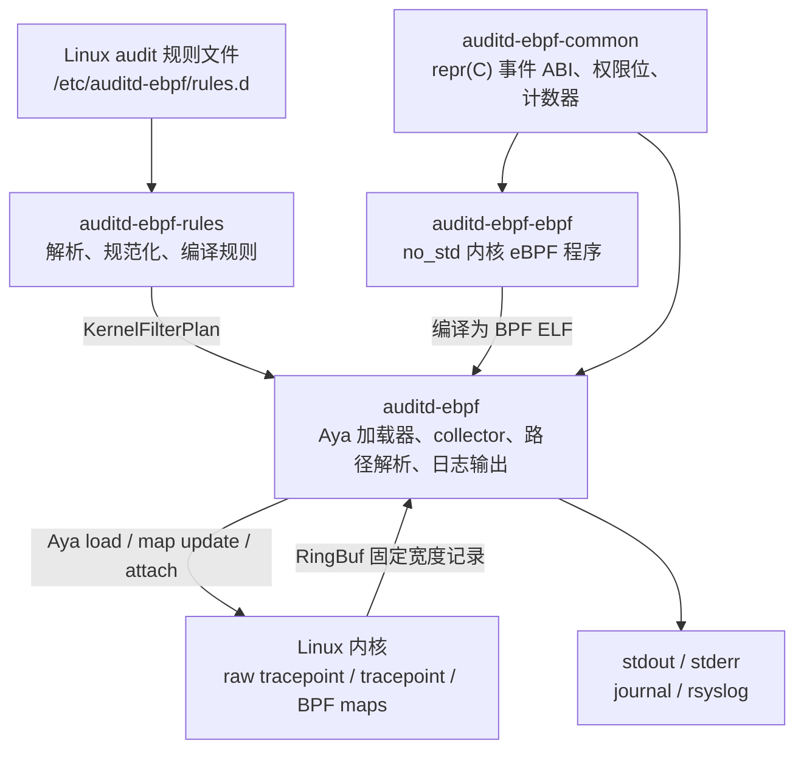
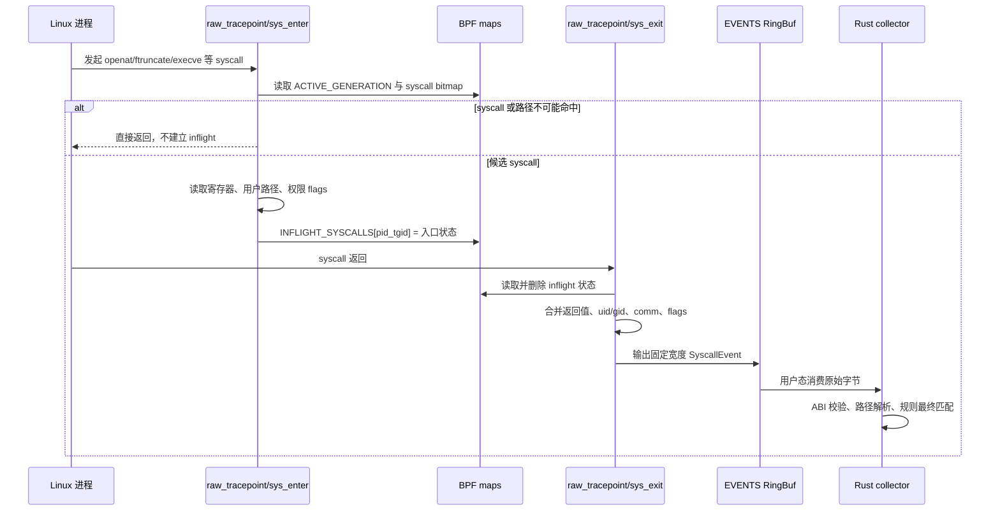
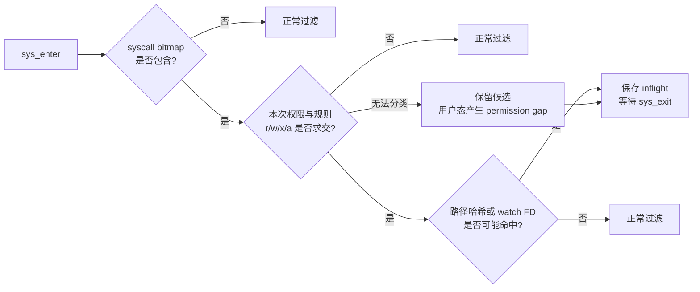
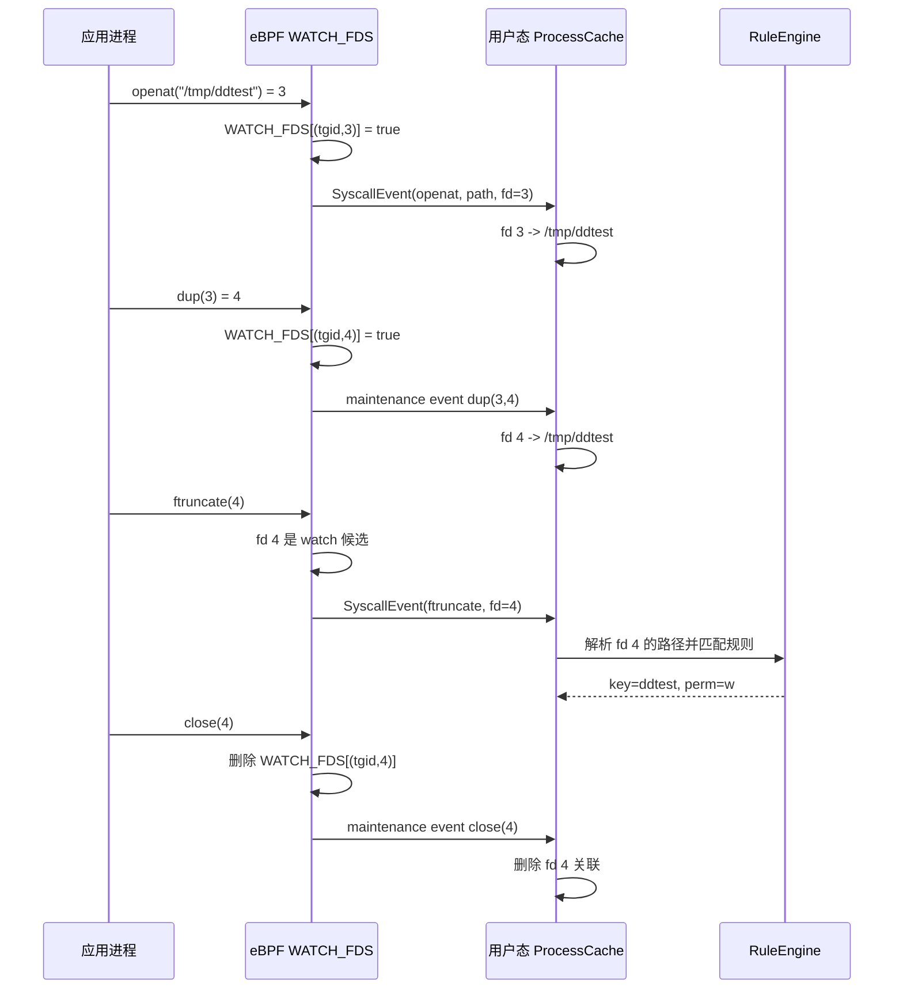
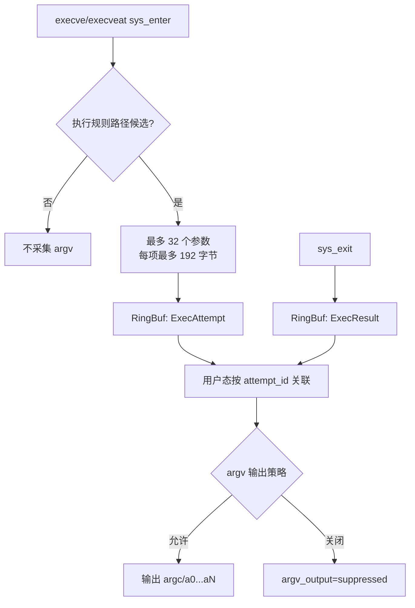
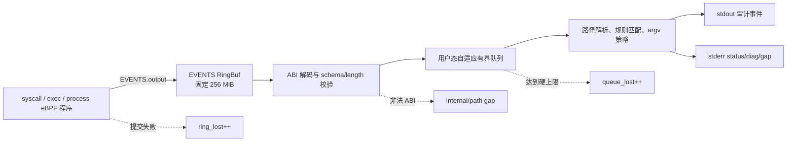
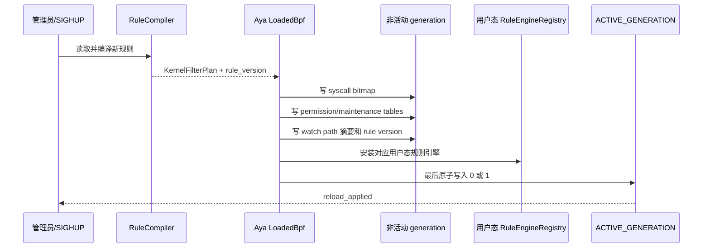

# eBPF 与 Aya 实现架构

本文说明 auditd-ebpf 中涉及的 eBPF 代码如何采集、过滤和传递审计候选事件，以及 Aya 相比
传统 C/libbpf 工作流简化了哪些工程环节。本文描述的是当前实现，不把 Rust 类型安全等同于
eBPF verifier 已证明业务语义正确。

## 1. 工程分层

项目把内核程序、共享 ABI 和用户态服务拆成独立 crate：



主要代码位置：

| 责任 | 路径 |
|---|---|
| eBPF crate 入口 | `crates/auditd-ebpf-ebpf/src/main.rs` |
| eBPF maps | `crates/auditd-ebpf-ebpf/src/maps.rs` |
| syscall 采集 | `crates/auditd-ebpf-ebpf/src/programs/syscall.rs` |
| exec argv 采集 | `crates/auditd-ebpf-ebpf/src/programs/exec.rs` |
| fork/exec/exit 生命周期 | `crates/auditd-ebpf-ebpf/src/programs/process.rs` |
| 内核/用户态共享 ABI | `crates/auditd-ebpf-common/src/event.rs` |
| Aya 加载与 attach | `crates/auditd-ebpf/src/loader.rs` |
| RingBuf 解码 | `crates/auditd-ebpf/src/collector/decode.rs` |
| 用户态路径与 FD 缓存 | `crates/auditd-ebpf/src/process_cache/` |

eBPF crate 在 BPF 目标下使用 `no_std` 和 `no_main`。它不能使用普通文件、线程、Socket、堆分配
或无界容器；所有读取、循环、事件大小和 map 容量都必须有明确上限。

## 2. 系统调用采集链路

内核端把系统调用拆成入口和出口两段。入口保存 syscall 参数，出口补充返回值，再形成一条完整
候选事件。



### 2.1 为什么需要 sys_enter 与 sys_exit

`sys_enter` 可以获得 syscall 编号和参数，但不知道最终结果；`sys_exit` 可以获得返回值，但不应
依赖退出时再次读取已经变化的用户内存。因此入口状态暂存在：

```text
INFLIGHT_SYSCALLS[pid_tgid] = InflightSyscall
```

`pid_tgid` 同时标识线程组和线程。正常被入口过滤的 syscall 不会创建 inflight 条目，所以出口
找不到条目不等于关联丢失；真正的 map 插入失败由 `inflight_dropped` 单独计数。

### 2.2 内核端候选过滤

内核程序不把全系统每个 syscall 都复制到用户态，而是依次执行：



过滤层次包括：

1. `SYSCALL_BITMAPS_B64/B32`：最多 512 个 syscall 的位图。
2. `PERMISSION_MASKS_B64/B32`：把规则权限映射到具体 syscall 和 open flags。
3. `WATCH_PATH_HASHES`、`WATCH_BASENAME_HASHES`：绝对路径和相对路径的低成本候选摘要。
4. `WATCH_FDS`：只让可能关联到 watch 路径的 FD-only syscall 进入 RingBuf。
5. `MAINTENANCE_BITMAPS_B64/B32`：采集 close、dup、chdir 等缓存维护事件，但不把它们自动输出为
   审计命中。

这些都只是候选过滤。相对路径、cwd、dirfd、root 和 mount namespace 的最终解释由用户态完成。

## 3. 路径与 FD 生命周期

`openat` 等 syscall 自带路径参数，而 `ftruncate`、`fchmod` 等只携带 fd。项目同时维护内核候选
FD 表和用户态可信路径表：



内核 `WATCH_FDS` 只用于削减流量，不承担最终审计结论。用户态还会处理：

- fork 后文件表继承；
- exec 后旧关联可靠性变化；
- fd 关闭和复用；
- dup/dup2/dup3/fcntl duplication；
- mount、setns、unshare 等只失效触发进程，而不是全局缓存；
- 无法证明路径时产生可计数 gap，禁止沿用不可靠旧路径。

## 4. exec argv 采集

exec 事件拆成 `ExecAttempt` 和 `ExecResult`：



只有 exec 路径候选通过后才读取 argv，避免一条执行 watch 为全系统 exec 复制大量参数。事件通过
固定上限保证 verifier 可分析和 RingBuf 记录可预测；超过限制会设置截断或读取失败标志。

项目默认允许匹配 exec 规则时原样输出 argv。日志可能包含口令、token、密钥和个人数据，部署
必须限制 journal、rsyslog、本地文件和远端接收端访问权限。不希望输出时可使用
`--no-emit-argv`。

## 5. RingBuf 与可观察丢失

内核与用户态通过固定 256 MiB RingBuf 传输记录：



RingBuf 创建后不能在线扩大，所以当前实现固定为 256 MiB，不提供“运行时动态扩容”。计数器用于
观察是否发生丢失，而不是用于扩容 RingBuf：

- `events_seen`：内核形成的候选数量；
- `events_submitted`：成功写入 RingBuf 的数量；
- `ring_lost`：RingBuf 提交失败；
- `inflight_lost`：入口状态无法写入 map；
- `internal_lost`：scratch 或内部资源失败；
- `queue_lost`：用户态队列达到硬上限；
- `path_lost`、`watch_fd_failures`：无法可靠恢复路径或 FD 关联。

任何非零丢失都必须进入健康状态与诊断输出，不能把“没有日志”解释为“没有事件”。

## 6. 双 generation 规则更新

规则 reload 不直接覆盖当前活动数据，而是先完整写入另一个 generation：



如果解析、编译或任一 map 更新失败，活动 generation 保持不变。旧的 RingBuf 事件携带原来的
`rule_version`，用户态仍可使用对应旧引擎完成处理，避免一半新规则和一半旧规则混用。

## 7. Aya 如何加载和管理 eBPF

用户态加载器的主要步骤为：

```text
读取 BPF ELF
    -> aya::Ebpf::load
    -> 按名称取得类型化 maps
    -> staging 规则数据
    -> 按名称取得 RawTracePoint/TracePoint
    -> program.load()
    -> program.attach(...)
    -> 取得 EVENTS RingBuf
    -> collector 开始消费
```

示意代码：

```rust
let bytes = std::fs::read(path)?;
let mut ebpf = aya::Ebpf::load(&bytes)?;

let program: &mut aya::programs::RawTracePoint =
    ebpf.program_mut("auditd_sys_enter").unwrap().try_into()?;
program.load()?;
program.attach("sys_enter")?;
```

Aya 在此封装：

- BPF ELF 解析和重定位；
- map 创建与 fd 生命周期；
- `BPF_PROG_LOAD`；
- raw tracepoint/tracepoint attach；
- link fd 生命周期；
- Array、PerCpuArray、HashMap、RingBuf 等类型化用户态 API；
- Rust `Result` 错误传播和 RAII 清理。

本项目仍按字符串取得 program/map，例如 `map_mut("ACTIVE_GENERATION")`。内核端改名而用户态
没有同步时，会在运行时加载失败；Aya 并未把所有跨 ELF 名称关系变成编译期检查。

## 8. Aya 与 C/libbpf 对比

### 8.1 工程流程

```mermaid
flowchart TB
    subgraph Aya["Aya / Rust"]
        ARust["eBPF Rust crate"] --> Cargo["Cargo + nightly + bpf-linker"]
        Common["共享 Rust repr(C) crate"] --> ARust
        Common --> AUser["Rust 用户态服务"]
        Cargo --> AElf["BPF ELF"]
        AElf --> AUser
        AUser --> ALoad["Aya load / attach / maps / RingBuf"]
    end

    subgraph Libbpf["C / libbpf 常见流程"]
        CBpf["*.bpf.c + SEC 宏"] --> Clang["Clang/LLVM"]
        Vmlinux["vmlinux.h / 公共 C header"] --> CBpf
        Clang --> CElf["BPF ELF"]
        CElf --> Bpftool["bpftool gen skeleton"]
        Bpftool --> Skeleton["*.skel.h"]
        Skeleton --> CUser["C 用户态 + libbpf"]
        CUser --> CLoad["open/load/attach/ring_buffer"]
    end
```



### 8.2 能力对照

| 方面 | Aya/Rust | C/libbpf |
|---|---|---|
| 内核端语言 | Rust `no_std` | C |
| 用户态语言 | Rust | 常见为 C/C++ |
| 运行时依赖 | 不链接 libbpf/BCC | 通常链接 libbpf，并依赖 libelf/zlib |
| 构建入口 | Cargo、nightly、`bpf-linker` | Clang/LLVM、Make/CMake、bpftool |
| 程序声明 | `#[raw_tracepoint]`、`#[tracepoint]` | `SEC("...")` |
| map 声明 | Rust 泛型 map 类型 | BTF map struct/宏 |
| 用户态 map 操作 | `Array`、`PerCpuArray`、`RingBuf` | skeleton 字段或 libbpf API |
| ABI 共享 | 共享 Rust crate + `repr(C)` | 公共 C header；跨语言时常需 bindgen |
| 错误处理 | `Result`、`?`、`anyhow/thiserror` | 错误码和显式 cleanup |
| 资源清理 | RAII 自动关闭 fd/link | 显式 destroy/free，skeleton 可部分简化 |
| 上游内核示例 | 相对少 | Linux/libbpf 生态最丰富 |
| CO-RE 与 bpftool 生态 | 支持但生态较年轻 | 最成熟、上游默认路径 |
| verifier 限制 | 完全保留 | 完全保留 |

### 8.3 Aya 实际简化的部分

对本项目最明显的收益是：

1. 规则引擎、服务、测试和内核程序都使用 Rust。
2. 内核和用户态直接共享 `SyscallEvent`、`ExecAttempt` 等固定 ABI 类型。
3. Cargo 统一依赖、workspace、测试、Clippy、rustfmt 和 release profile。
4. 不需要把 Rust 服务再通过 FFI 接到 libbpf skeleton。
5. map、program、RingBuf 和错误路径与普通 Rust 服务更容易整合。
6. Rust RAII 减少加载失败和停止路径中的 fd/link 清理遗漏。

### 8.4 Aya 没有简化掉的部分

Aya 只改变工程和 API，不改变 eBPF 的内核约束：

- Rust 编译通过不代表 verifier 一定接受；
- 复杂分支仍可能触发 verifier 状态爆炸；
- eBPF 栈仍然很小，大事件必须放进 Per-CPU scratch map；
- 循环、路径、argv 和 map 容量必须显式有界；
- 用户地址和内核地址仍只能通过 BPF helper 安全探测；
- `pt_regs`、syscall 编号和 b64/b32 ABI 差异仍需人工处理；
- 跨 CPU RingBuf 事件顺序和 enter/exit 关联仍需设计；
- mount namespace、cwd、dirfd、fork、exec 和 FD 复用仍是审计正确性的核心难点；
- verifier 证明内存安全，不会证明“这条路径一定就是用户意图审计的文件”。

因此，Aya 更准确的定位是：

> Aya 显著简化了 Rust 项目的 eBPF 工程化、加载、类型共享和资源管理，但没有消除 verifier、
> 内核 ABI、受限执行环境以及审计语义正确性这些核心难题。

## 9. 当前兼容与安全边界

- 首版面向 x86_64 Linux 5.15+，要求 BTF、BPF syscall、raw tracepoint、tracepoint 和 RingBuf。
- 规则编译生成 b64/b32 覆盖，但真实 b32 执行只能在提供 32 位可执行环境的主机上验证。
- 当前实现主要使用稳定 tracepoint/raw tracepoint、`pt_regs` 和 syscall 表；没有把 CO-RE 作为
  任意内核结构读取的核心路径。
- sched tracepoint attach 前会检查 tracefs `format`，不兼容时拒绝启动。
- 路径为 namespace lexical 解释，不声明 inode、hard-link 和 symlink 身份语义与传统 audit
  watch 完全等价。
- 无法可靠分类权限、恢复路径或关联 FD 时输出 gap 并降低健康状态，禁止猜测或静默丢弃。
- RingBuf 固定 256 MiB，不支持运行时扩容；容量不足必须通过丢失计数和基准测试发现。

## 10. 构建与观察

构建内核端和用户态：

```bash
cargo xtask build-ebpf --release
cargo build --workspace --release
```

加载并运行：

```bash
sudo target/release/auditd-ebpf run \
  --ebpf-object target/bpfel-unknown-none/release/auditd-ebpf-ebpf \
  --rules-dir /etc/auditd-ebpf/rules.d
```

查看内核中已加载的程序和 maps：

```bash
sudo bpftool prog show
sudo bpftool map show
```

执行 host verifier 与内核 smoke：

```bash
cargo xtask test-kernel --kernel host
```

检查服务健康状态时重点观察：

```text
state=healthy
ring_lost=0
inflight_lost=0
correlation_lost=0
internal_lost=0
queue_lost=0
path_lost=0
watch_fd_failures=0
gaps_generated=0
```
